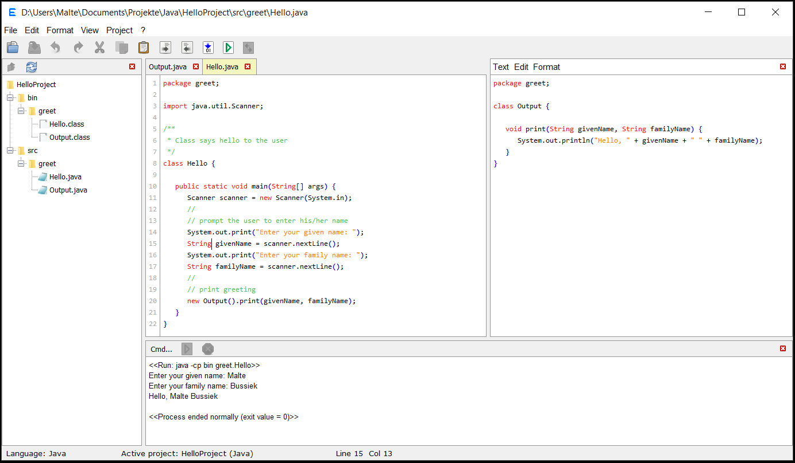

<h3>Eadgyth Programming Editor</h3>

A text editor which can be easily set up to run source code. So far, built-in
functions to run a program are available for code written in Java, Perl, Python, R and
HTML. Extending the source code of the editor to add support for other langauages can
be reasonably easily realized too. 
 

<h4>Features for editing text are ...</h4>
<ul>
<li>Find/replace.</li>
<li>Clearing end-of-line (trailing) white spaces.</li>
<li>Choosing between spaces and tabs for indentation.</li>
<li>Auto-indentation which distinguishes "curly-bracket-indentation".</li>
<li>Block-wise increase or decrease of the indentation.</li>
<li>An 'notes' editor next to the main editor for notes, viewing text
    or facilitated exchange of text.</li>
<li>A basic syntax highlighting (for Java, Perl, Python, R, HTML, XML, CSS,
    Javascript, PHP).</li>
</ul>

<h4>Features for running source code are ...</h4>
<ul>
<li>A console for showing output/error during running (or compiling) a program and
    entering input in interactive command-line programs.</li>
<li>Run a program by pre-defined functions or run self-chosen system commands.</li>
<li>Specify additional command options/arguments for running a program</li>
<li>Compile and run Java code that is organized in packages and create an executabe jar
    file of a Java program.</li>
<li>View HTML code in the default Browser.</li>
<li>Set several coding projects which can be switched between.</li>
<li>Retrieval of projects after newly starting the program.</li>
</ul>

A little more about it and examples how to use the editor is found
<a href="https://eadgyth.github.io/Programming-Editor/">here</a>.
To try the program the executable jar file in a
<a href="https://github.com/Eadgyth/Programming-Editor/releases">release</a> may be used.
 
<h4>REQUIREMENTS</h4>

Running and compiling the program requires Java 8 or higher. Building an executable jar
file of the editor can be done, for example, after creating a Java project with existing
sources in Netbeans using the src folder from the repository as sources directory.

If this editor is used for compiling Java code by the built-in compile option it must
be made sure that it is run using the JRE contained in a JDK (and not the public JRE).

For using the built-in function to run code the path variables that point to the executables
of a programming language may have to be set in the OS (they have to under Windows).
 
<h4>LIMITATIONS</h4>

There are countless limitations ... but one should be mentioned:

The editor includes a 'console' for showing output/error of a process started from within
the editor. Also entries are possible. However, this console is not like the terminal/
CMD of the OS. This can cause unexpected results, if the output of a process is buffered
(because it does not go to the standard output). Among the project categories built-
in so far, this limitation applies to interactive Perl scripts but may apply to custom
commands unless a command-line switch that disables buffering is available.
 
<h4>ACKNOWLEDGEMENTS</h4>

Special thanks go to William Gilreath for his advice, comments and enthusiasm.
 

The program uses icons from
<a href="https://github.com/Distrotech/tango-icon-theme">Tango Desktop Project</a>.
 
<h4>LICENSE</h4>

MIT, see LICENSE 

<h4>SCREENSHOT</h4>

An example Java "project" run in the editor:
 
 
  
