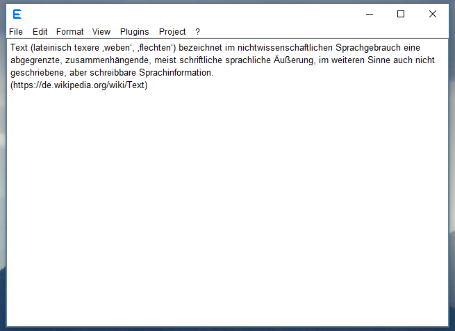

# Java-Programming-Editor / Eadgyth
A coding text editor, written in Java, with a flexible setting of projects and switching
between projects.

The goal of this program is a coding editor suited to write and test rather simple
applications, may be for home or lerning requirements, and to provide a simple but flexible
setting up of projects.

The coding language is Java. To illustrate that other project categories can be added draft
implementations for setting projects for writing in Perl and HTML are included.

REQUIREMENTS FOR TESTING AND COMPILATION 
Running the program requires JAVA 8 (JRE 8). Modifications to use Java 9 have yet to be done.

The program must be found in the same folder as the two .properties files and the Resources
folder, just like found in the 'EadgythProgram' folder in this repository.

To compile the program the source files (packages) must be placed in a directory that also
includes the ".properties" files and the 'Resources' folder

DOCUMENTATION 
A guide how to configure a project and some other info is found in
<a href="https://rawgit.com/Eadgyth/Java-Programming-Editor/master/EadgythProgram/Resources/Help.html">Help.html</a>.
This file is also addressable from the 'Help' menu in the program. For an overwiew of the
program code the
<a href="https://rawgit.com/Eadgyth/Java-Programming-Editor/master/javadoc/index.html">javadoc</a>
is hopefully helpful.

LIMITATIONS (related to functions that are there at least)  
1) Running an interactive (console) program that then requires writing to this process is not
guaranteed to work in the console area of the program. Interactive programs in Java seem to
work fine but, for example, an interactive Perl script does not unless the autoflushing of its
STDOUT is enabled in the script itself.
 
2) The built in packing of a jar file for a java app. bundles only .class files.
 
3) The printing to a printer is rudimentary and is rather the blueprint for a printing function.
The font size is different from the corresponding font size in other programs (e.g. Editor in Windows).
 
4) The syntax coloring is incomplete

PROBLEMS  
1) Unexpected rendering of the UI happened when the system look and feel was selected and the
program was idling for a longer period of time (under Windows 10). 

IDEAS FOR FURTHER DEVELOPEMENT 
1) To develop different types of projects (for coding or other). A type of project is defined by
   the interface 'ProjectActions' in the 'projects' package. 
2) To develop "Edit Tools" that can do specialized work with text files. An edit tool implements
   'AddableEditTool' in the 'edittools' package. It can be included in the main window and has
   access to the file in the selected tab (the interface replaces the plugin interface in previous
   commits).

LICENSE: MIT, see LICENSE 

FEATURES 
The program includes
<ul>
   <li>Showing files in tabs</li>
   <li>A basic file explorer for projects</i>
   <li>A basic console to view the output (error messages) during compiling and testing
   a program (also allows running self-chosen system commands)</li>
   <li>An "exchange editor" view to modify or exchange between files text sections in a
   separate view
</ul>
(Under Windows 10, setting the system look and feel) 

