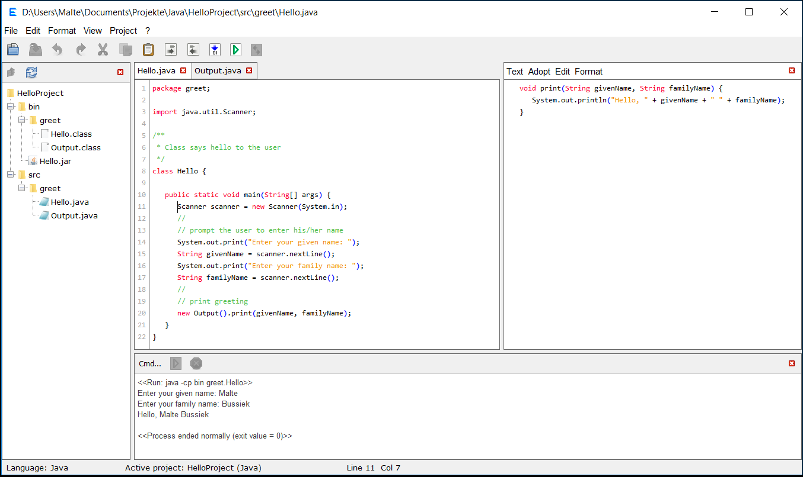

The motivation for writing this program is to have a text editor that helps coding in many ways
but that is at the same time simple to work with as much as possible.

A list of the features of the program and documentation can be found under
<a href="https://eadgyth.github.io/Programming-Editor/">Help and documentation</a>.

REQUIREMENTS FOR TESTING 
An executable jar archive of the progam is found in the folder "JarAndPreferences". The jar file
was created by the program itself but has also been successfully built in Netbeans.

Running (and compiling) the program requires Java 8. Running it using Java 9 causes some problems
with regard to the graphical interface (at least under Windows).

For compiling Java code by the compile option in the program it must be made sure that the
program is run using the JRE contained in the JDK.

LIMITATIONS 
Among the countless limitations at the present stage some need mention:
<ul>
<li>Running an interactive program that asks for input through a command-line is not guaranteed
    to work in the console area of the program. Interactive programs in Java seem to work fine but,
    for example, an interactive Perl script does not unless the autoflushing of Perl's STDOUT is
    enabled in the script itself.</li>
<li>The compilation of java files and the creation of an executable jar file cannot include
    exteral libraries if the corresponding pre-defined options in the menu or the toolbar are
    selected.</li>
<li>The printing to a printer is rudimentary and is rather the blueprint for a printing function.
    The font size relative to the page size is not controlled.</li>
<li>The program is so far tested on Windows by the author (me). I would appriciate feedback from
    somebody who may have tried it on other platforms.</li>
</ul>

IDEAS FOR FURTHER DEVELOPEMENT 
<ul>
<li>To develop different types of projects (for coding or other). A type of project is defined by
   the interface 'ProjectActions' in the 'projects' package.</li>
<li>To develop "Edit Tools" that can do specialized work with text files. An edit tool implements
   'AddableEditTool' in the 'edittools' package. It's graphical view can be included in the main 
   window and it has access to the file in the selected tab (the interface replaces the plugin
   interface in previous commits).</li>
</ul>

ACKLOWLEDGEMENT 
The program uses icons from
<a href="https://github.com/Distrotech/tango-icon-theme">Tango Desktop Project</a>.

LICENSE: MIT, see LICENSE 

The first screenshot shows a Java project that has a typical directory structure and that is
run in the program. The lower screenshot shows the simple editor view.

 

