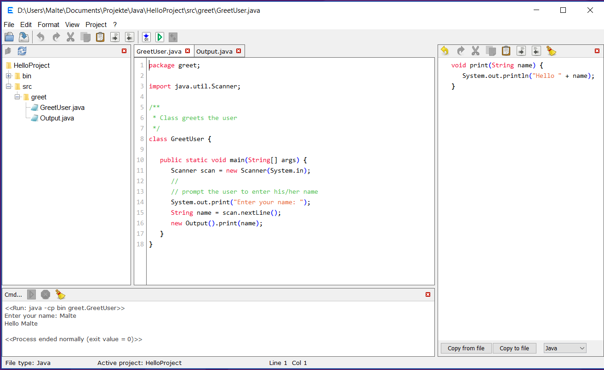
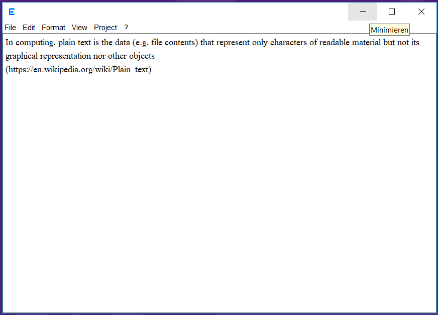

Eadgyth is a simple source code text editor, written in Java, with an easy and flexible
setting up of coding projects for compiling and testing.

The motivation is to have an editor that helps coding in may ways but that is at the
same time simple to work with as much as possible. It may be especially suited to write
and test applications for home or lerning requirements.

The coding language is currently Java but the program is made to integrate other languages
or types of projects. To illustrate this draft implementations for writing in Perl and HTML
are included.

FEATURES 
<ul>
   <li>Showing files in tabs</li>
   <li>Undo / redo</li>
   <li>Block-wise indentation</li>
   <li>A basic file explorer for projects</i>
   <li>An "exchange editor" (the panel at the right in the image below) to edit text in a
   separate view and to facilitate the exchange of text within a file or between files</li>
   <li>A basic syntax highlighting for java, perl, html and javascript and a basic
   auto-indentation</li>
   <li>The setting of projects without creating any extra data files outside the program's
   own folder (a config file may optionally be saved in a project's folder though). Projects
   can be retrieved after newly starting the program and a number of projects can be defined
   and set active during the program's runtime</li>
   <li>Compiling and testing Java code and bundling a Java program in a jar file; testing
   a Perl script; viewing Html code in the default web browser</li>
   <li>A basic (interactive) console to view the output (error messages) during compiling
   and testing a program (also allows running self-chosen system commands)</li>
</ul>
(Under Windows 10, setting the system look and feel) 

REQUIREMENTS FOR TESTING 
Running the program requires Java 8 (JRE and JDK). Java 9 was tried but did not work ok
graphically. Also, compiling java code from within the program did not work with Java 9
unless the program was started from the cmd (tested under Windows 10).

The program must be found in the same folder as the two .properties files and the Resources
folder, just like found in the 'EadgythProgram' folder in this repository.

DOCUMENTATION 
A guide how to configure a project and some other info is found in
<a href="https://rawgit.com/Eadgyth/Java-Programming-Editor/master/EadgythProgram/Resources/Help.html">Help.html</a>.
This file is also addressable from the 'Help' menu in the program. For an overwiew of the
program code the
<a href="https://rawgit.com/Eadgyth/Java-Programming-Editor/master/javadoc/index.html">javadoc</a>
is hopefully helpful.

LIMITATIONS (related to functions that are there at least)  
1) Running an interactive program that asks for input through a command-line is not guaranteed
to work in the console area of the program. Interactive programs in Java seem to work fine but,
for example, an interactive Perl script does not unless the autoflushing of its STDOUT is enabled
in the script itself.
 
2) The built in packing of a jar file for a java application bundles only .class files.
 
3) The printing to a printer is rudimentary and is rather the blueprint for a printing function.
The font size is different from the corresponding font size in other programs (e.g. Editor in Windows).
 
4) The syntax coloring is incomplete

IDEAS FOR FURTHER DEVELOPEMENT 
1) To develop different types of projects (for coding or other). A type of project is defined by
   the interface 'ProjectActions' in the 'projects' package. 
2) To develop "Edit Tools" that can do specialized work with text files. An edit tool implements
   'AddableEditTool' in the 'edittools' package. It can be included in the main window and has
   access to the file in the selected tab (the interface replaces the plugin interface in previous
   commits).

LICENSE: MIT, see LICENSE 
