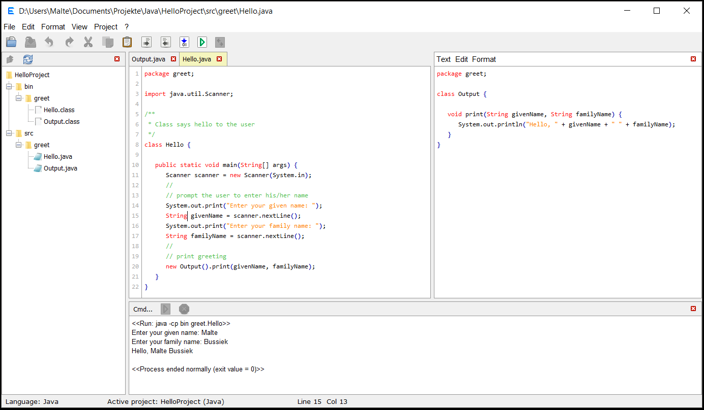

<h3>Eadgyth Programming Editor</h3>
<p>
A text and code editor written in Java. It features a simple project setup to compile
and run code from within the editor. Built-in functions to run code are available for
Java, C#, Python and R. The editor is intended for learning, quick prototyping, or
programming projects for personal use.
<p>
The editor can be tried out by downloading the executable jar file in a
<a href="https://github.com/Eadgyth/Programming-Editor/releases">release</a> (requires a
JDK, version 8 or higher). It is run with:

```
java -jar Eadgyth.jar
```

<h4>Features for editing text are ...</h4>
<ul>
<li>Find/replace.</li>
<li>Clearing end-of-line (trailing) white spaces.</li>
<li>Choosing between spaces and tabs for indentation.</li>
<li>Auto-indentation which distinguishes "curly-bracket-indentation".</li>
<li>Block-wise increase or decrease of the indentation.</li>
<li>A 'notes' editor next to the main editor.</li>
<li>A basic syntax highlighting (for Java, Perl, Python, R, HTML, XML, CSS,
    Javascript, PHP, C#).</li>
</ul>
<p>
<h4>Features for running source code are ...</h4>
<ul>
<li>Compile and run Java code that may be organized in packages and create an
    executable jar file.</li>
<li>Compile and run C# code using .NET SDK.
    Note: the editor creates a new minimal .csproj file on every compile.</li>
<li>Run scripts in Python or R.
<li>Specify additional options or arguments for the built-in commands.</li>
<li>View HTML code in the default browser.</li>
<li>A console for showing output/error during running (or compiling) a program
and entering input in interactive command-line programs.</li>
<li>Set up several projects which can be switched between and retrieve project
settings after newly starting the editor.</li>
</ul>
<h4>REQUIREMENTS</h4>
<ul>
<li>JDK 8 or higher to run and build the editor</li>.
<li>To compile Java code by the built-in compile function mus be run with the JRE
contained in a JDK (not an issue with Java 11+).</li>
<li>[!Important]: Environment variables must be set to compile or run code from
within the Editor (i.e. the paths to Python, R, dotnet).</li>
<li>The editor expects UTF-8 to run source code (the option to convert files to
UTF-8 is available).</li>
</ul>
<h4>LIMITATIONS</h4>
<ul>
<li>Syntax highlighting is basic.</li>
<li>The built-in console may appear frozen when a process buffers its output. This
potentially affects custom commands. This can often be resolved by enabling
auto-flushing via a command-line switch or script command if the language supports
it.</li>
</ul>
<h4>CREDITS & ACKNOWLEDGEMENTS</h4>
<ul>
<li>William Gilreath for his advice, comments, enthusiasm</li>
<li>The program uses icons from
<a href="https://github.com/Distrotech/tango-icon-theme">Tango Desktop Project</a>.</li>
<li>The dark-blue background uses the
<a href="https://github.com/dracula/dracula-theme">Dracula Color Palette</a> and 
other the dark backgrounds have learned from it.</li>
</ul>
<h4>LICENSE</h4>
<p>
MIT, see LICENSE<br>
<p>
<h4>SCREENSHOTS</h4>
<p>
An example for a command-line program in Java (Eadgyth run on Windows 10):
<br>
<br><br>
<br>
The 'Dracula' derived dark-blue background:
<br><br>
