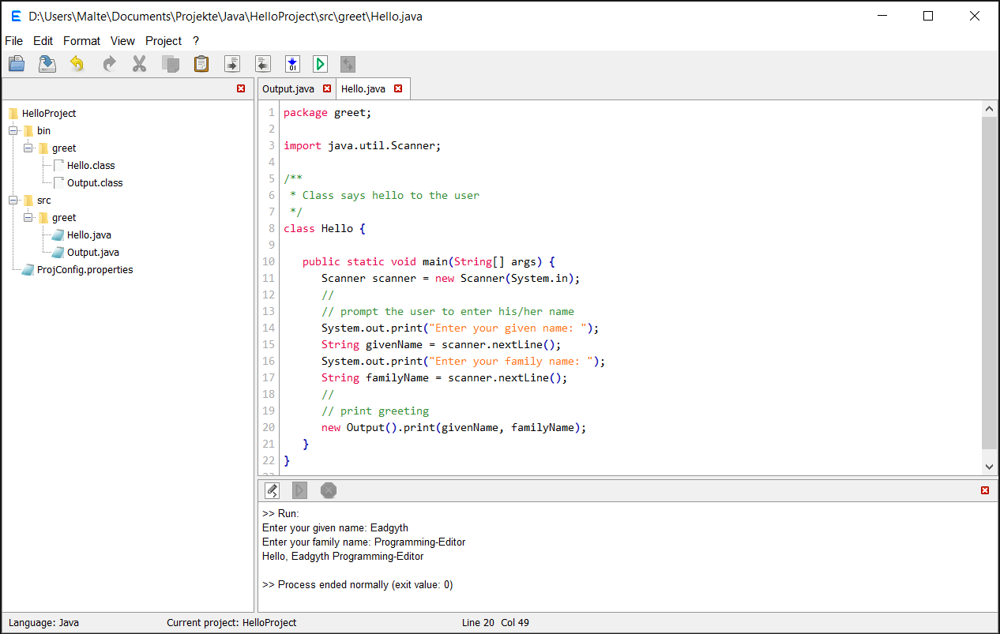

<h3>Eadgyth Programming Editor</h3>
A text and code editor with the possibility to easily set up coding projects,
first of all for Java. Additional project categories are Python, R, Perl and
HTML as well as 'Custom commands' to define own commands. Extending the source
code to add support for other categories can be reasonably easily realized for
which the additional categories give examples.
  
The editor may be useful for writing applications for own use, learning or quickly
trying out code in case that a more advanced code editor or IDE is not necessary
(examples for project settings can be found
<a href="https://eadgyth.github.io/Programming-Editor/">here</a>). The program can
be tried out by using the executable jar file in a
<a href="https://github.com/Eadgyth/Programming-Editor/releases">release</a>
(requires a JDK, version 8 or higher).
 

<h4>Features for editing text are ...</h4>
<ul>
<li>Find/replace.</li>
<li>Clearing end-of-line (trailing) white spaces.</li>
<li>Choosing between spaces and tabs for indentation.</li>
<li>Auto-indentation which distinguishes "curly-bracket-indentation".</li>
<li>Block-wise increase or decrease of the indentation.</li>
<li>A 'notes' editor next to the main editor for notes, viewing text
    or facilitated exchange of text.</li>
<li>A basic syntax highlighting (for Java, Perl, Python, R, HTML, XML, CSS,
    Javascript, PHP, C#).</li>
</ul>

<h4>Features for running source code are ...</h4>
<ul>
<li>Compile and run Java code that may be organized in packages and create an
    executable jar file. Use external libraries and, if run with JDK 9+, library
    modules. Also, optionally run a module in Java 9+.</li>
<li>Run scripts in Python, R or Perl.
<li>Specify additional options or arguments for the built-in commands.</li>
<li>View HTML code in the default browser.</li>
<li>Specify own system commands to compile, run and/or build (associated with
    corrsponding UI controls) in a 'Custom commands' project category, for example,
    to run own batch files/shell scripts.</li>
<li>A console for showing output/error during running (or compiling) a program and
    entering input in interactive command-line programs.</li>
<li>Set up several projects which can be switched between and retrieve project settings
    after newly starting the editor.</li>
<li>View a project in a file view from where also files can be opened and project
    subdirectories created.
</ul>
<h4>REQUIREMENTS</h4>

Compiling the program requires Java 8 or higher. Building an executable jar file of
the editor can be done, for example, after creating a Java project with existing
sources in Netbeans using the src folder from the repository as sources directory.

If the editor is used for compiling Java code by the built-in compile function it must
be made sure that it is run using the JRE contained in a JDK (with Java 11 only a
JDK but no separate JRE is available anyway).

For using the built-in function to run code the path variables that point to the
executables of a programming language may have to be set in the OS (they have to under
Windows).
 
<h4>LIMITATIONS</h4>

The console of the editor may appear "frozen" in cases that the output of a process
is buffered because of redirecting its standard output to the GUI. Among the given
project categories this applies to Perl (noticable in an interactive console program)
and it may apply to custom commands. This block-buffering may be disabled (or auto-
flushing enabled) by a command-line switch or a command in a script itself if
available for a language (for comparison and for the time using this editor!).
 
<h4>CREDITS & ACKNOWLEDGEMENTS</h4>
<ul>
<li>William Gilreath for his advice, comments, enthusiasm</li>
<li>The program uses icons from
<a href="https://github.com/Distrotech/tango-icon-theme">Tango Desktop Project</a>.</li>
<li>The dark-blue background uses the
<a href="https://github.com/dracula/dracula-theme">Dracula Color Palette</a> and 
other dark backgrounds have learned from it.</li>
</ul>
<h4>LICENSE</h4>

MIT, see LICENSE 

<h4>SCREENSHOTS</h4>

An example for a command-line program in Java (Eadgyth run on Windows 10):
 
  
 
The 'Dracula' derived dark-blue background:
  
