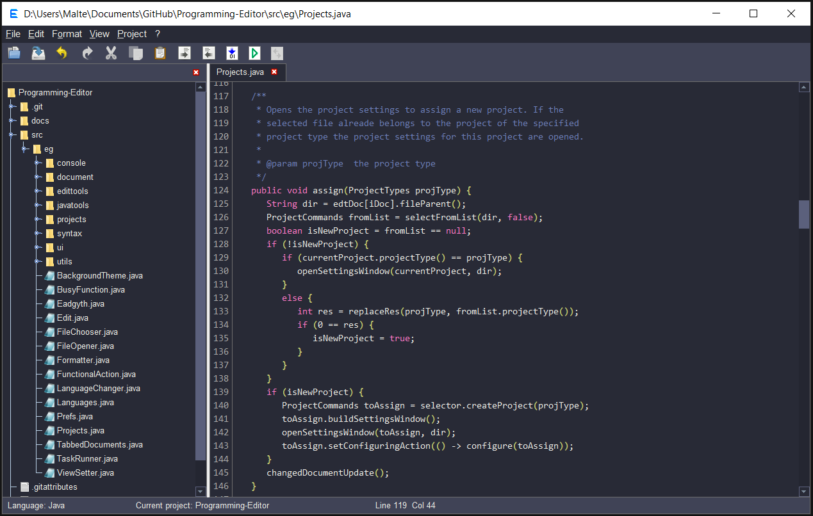

<h3>Eadgyth Programming Editor</h3>

A text and code editor with the possibility to easily set up coding projects,
first of all for Java. Setting a project means that it can be run (or compiled)
by built-in functions that are invoked by menu selections, button clicks or with
the keyboard. Additional project categories are C#, Python, R, Perl and HTML as well
as a category 'Custom commands' to define own commands to run own batch files/scripts,
for example.

The editor may be useful for writing applications for own use, learning or quickly
trying out code in case that a more advanced code editor or an IDE is not necessary
(examples for project settings can be found
<a href="https://eadgyth.github.io/Programming-Editor/">here</a>). The program can
be tried out by downloading the executable jar file in a
<a href="https://github.com/Eadgyth/Programming-Editor/releases">release</a>
(requires a JDK, version 8 or higher). The additional idea is that other project
categories can be implemented as needed (To do: add a guide for programming a
project type).

<h4>Features for editing text are ...</h4>
<ul>
<li>Find/replace.</li>
<li>Clearing end-of-line (trailing) white spaces.</li>
<li>Choosing between spaces and tabs for indentation.</li>
<li>Auto-indentation which distinguishes "curly-bracket-indentation".</li>
<li>Block-wise increase or decrease of the indentation.</li>
<li>A 'notes' editor next to the main editor for notes, viewing text
    or facilitated exchange of text.</li>
<li>A basic syntax highlighting (for Java, Perl, Python, R, HTML, XML, CSS,
    Javascript, PHP, C#).</li>
</ul>

<h4>Features for running source code are ...</h4>
<ul>
<li>Compile and run Java code that may be organized in packages and create an
    executable jar file. Use external libraries and, if run with JDK 9+, library
    modules. Also, optionally run a module in Java 9+.</li>
<li>Compile and run C# code (v. 1.2.0) and use compiler options for the output
    target. The built-in compile command invokes csc compiler (Windows) or Mono
    mcs compiler (Linux/Mac). The PATH to these executables must be set
    (see Requirements).</li>
<li>Run scripts in Python, R or Perl.
<li>Specify additional options or arguments for the built-in commands.</li>
<li>View HTML code in the default browser.</li>
<li>A console for showing output/error during running (or compiling) a program and
    entering input in interactive command-line programs.</li>
<li>Set up several projects which can be switched between and retrieve project settings
    after newly starting the editor.</li>
<li>View a project in a file view from where also files can be opened and project
    subdirectories created.
</ul>
<h4>REQUIREMENTS</h4>

Compiling the program requires Java 8 or higher. It can be built by creating a Java
project with existing sources in Netbeans or Eclipse using the src folder from the
repository as sources directory. It can also be built by the program itself using the
executable jar file in a
<a href="https://github.com/Eadgyth/Programming-Editor/releases">release</a> 🙂.

To compile Java code by the built-in compile function it must be made sure that it is
run using the JRE contained in a JDK (as of Java 11 only a JDK but no separate JRE is
available anyway).

<b>Important:</b> To run code by the built-in functions (presently in the project
categories Java, C#, Python, R and Perl) the path variables that point to the executables
of a programming language must be set in the OS as permanent environment variables.
 
<h4>LIMITATIONS</h4>

Apart from the fact that the syntax highlighting is rather simple the example of the
Perl language shows that it cannot cover all kinds of syntax elememts (in this case:
regex give an example).

The console of the editor may appear "frozen" in cases that the output of a process
is buffered because its standard output is redirected to the 'console' of this program.
Among the given project categories this applies to Perl (noticable in an interactive
console program) and it may apply to custom commands. This block-buffering may be
disabled (or auto-flushing enabled) by a command-line switch or a command in a script
itself if available for a language (for comparison and for the time using this editor!).
 
<h4>THE NAME</h4>

The name of the program is 'Eadgyth' although it's the owner (me) of the repo and
not the repo name. I haven't thought about it in the beginning but it shall not be
changed. Eadgyth (as an Old English version of the name Edith) does not refer to
Queen Eadgyth of Wessex but to MS-DOS Editor which was invoked by typing 'edit'.
 
<h4>CREDITS & ACKNOWLEDGEMENTS</h4>
<ul>
<li>William Gilreath for his advice, comments, enthusiasm</li>
<li>The program uses icons from
<a href="https://github.com/Distrotech/tango-icon-theme">Tango Desktop Project</a>.</li>
<li>The dark-blue background uses the
<a href="https://github.com/dracula/dracula-theme">Dracula Color Palette</a> and 
other the dark backgrounds have learned from it.</li>
</ul>
<h4>LICENSE</h4>

MIT, see LICENSE 

<h4>SCREENSHOTS</h4>

An example for a command-line program in Java (Eadgyth run on Windows 10):
 
  
 
The 'Dracula' derived dark-blue background:
  
