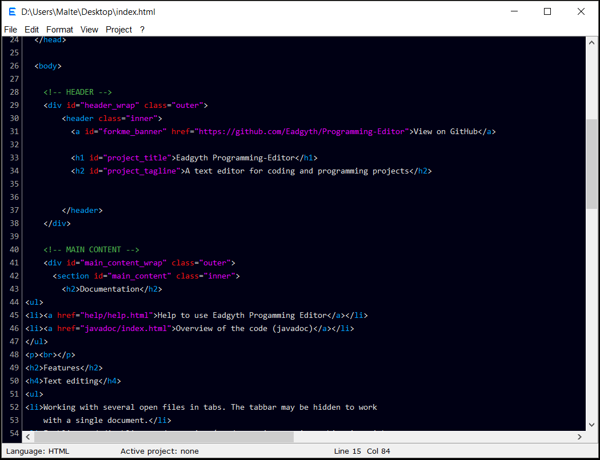

<h2>Documentation</h2>
<ul>
<li><a href="help/help.html">Help to use Eadgyth Progamming Editor</a></li>
<li><a href="javadoc/index.html">Overview of the code (javadoc)</a></li>
</ul>
 
<h2>Features</h2>
<h4>Text editing</h4>
<ul>
<li>Working with several open files in tabs. The tabbar may be hidden to work
    with a single document.</li>
<li>Enabling and disabling word-wrapping (word-wrapping not in combination with
    showing line numbers, however).</li>
<li>Undo/redo.</li>
<li>A basic find and find/replace function.</li>
<li>Clearing end-of-line (trailing) white spaces.</li>
<li>An "exchange editor" pane to edit text in a separate view and to facilitate
    the exchange of text within a file or between files.</li>
<li>A basic syntax highlighting (for Java, Perl, Python, R, HTML, XML, CSS,
    Javascript, PHP).</li>
<li>A basic auto-indentation which distinguishes "curly-bracket-indentation".</li>
<li>Block-wise increase or decrease of the indentation.</li>
</ul>
<h4>Running source code</h4>
<ul>
<li>An easy assignment of files as coding project and setting of parameters for a
   project.</li>
   <ul>
   <li>A project may be simply the location of (source) files.</li>
   <li>The program can work with a given directory structure of a project,
       that is folders for source files or for executable files within a project
       directory. Packages are taken into account in a Java project.</li>
   <li>A number of projects can be set in parallel and switch between.</li>
   <li>Retrieval of already defined projects after newly starting the program.</li>
   </ul>
<li>Pre-defined actions to run (or compile/build) a project.</li>
   <ul>
   <li>Compile/run Java code and bundling a Java program in an executable
       jar file.</li>
   <li>Check syntax of and run a Perl script.</li>
   <li>Run a Python script.</li>
   <li>Run an R script.</li>
   <li>View Html code in the default web browser.</li>
   </ul>
<li>A basic console to view the output and error messages after compiling a Java
    program or during running a project. The console also allows to enter input
    in an interactive command line program (see
    <a href="https://github.com/Eadgyth/Programming-Editor/blob/master/README.md">
    README</a> for limitations).
    </li>
<li>Running self-chosen system commands in the current working (project) directory.
    The output of the process is shown in the console. Such commands may be used
    for actions that are not pre-defined in a project category, for example to run
    script files. Also, a generic project without any pre-defined actions and
    dependency on a certain file type may be assigned to run system commands.</li>
</ul>
<h4>Other</h4>
<ul>
<li>A file explorer for the project that is set active</li>
</ul>
 
<h2>Screenshots</h2>
Example Java project run in the program 
  
Html code in dark theme 
  
Simple editor view 

