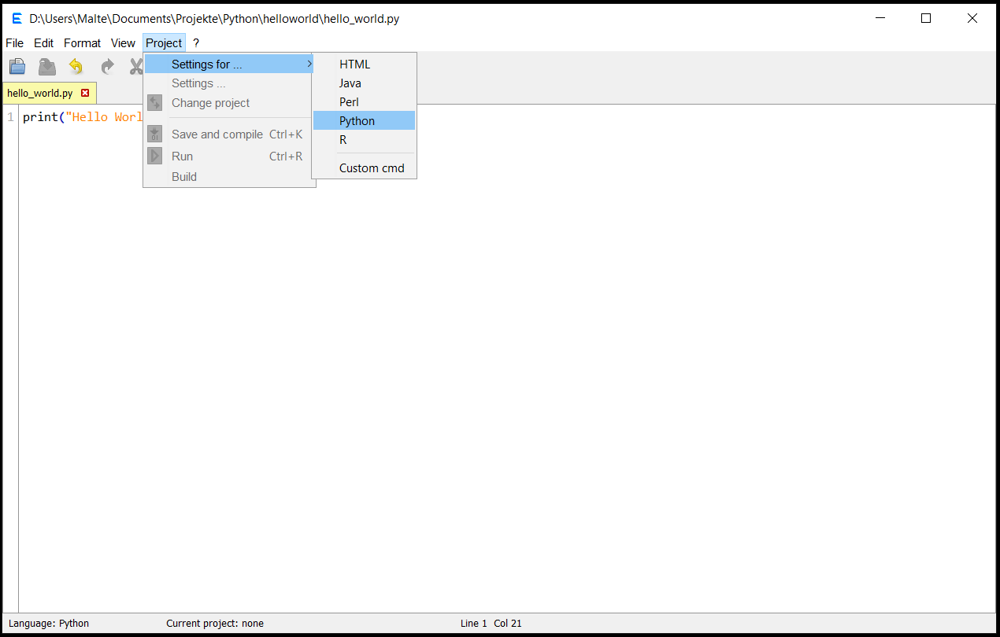
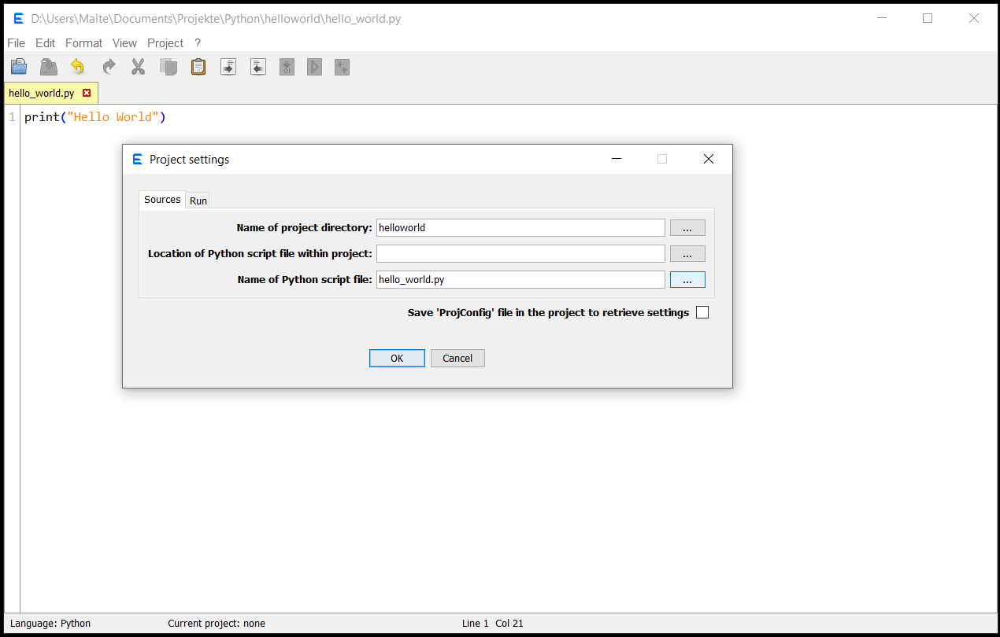
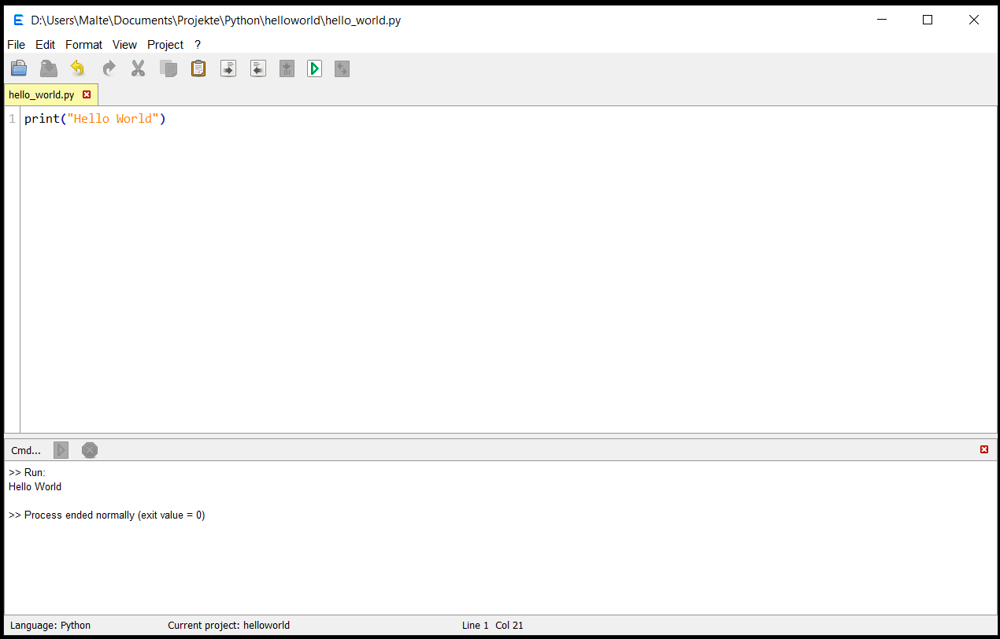
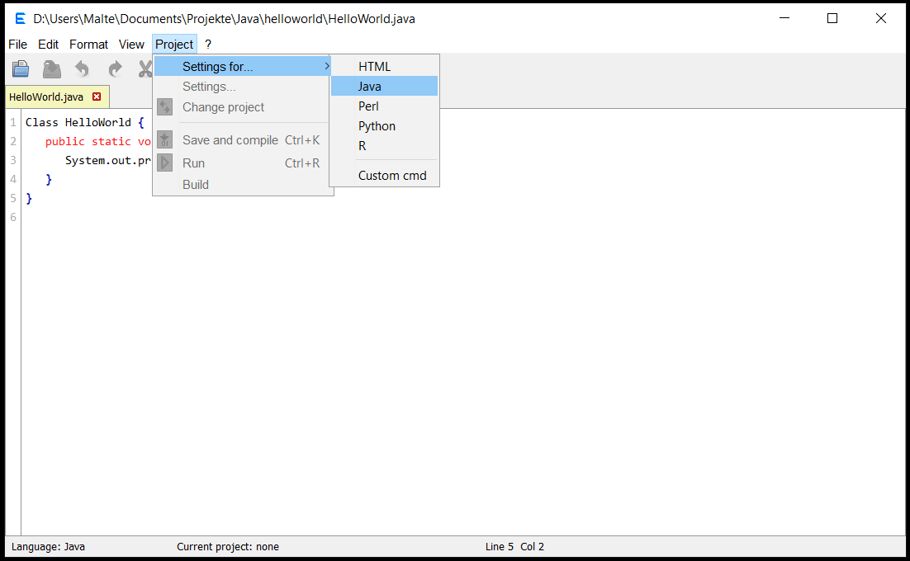
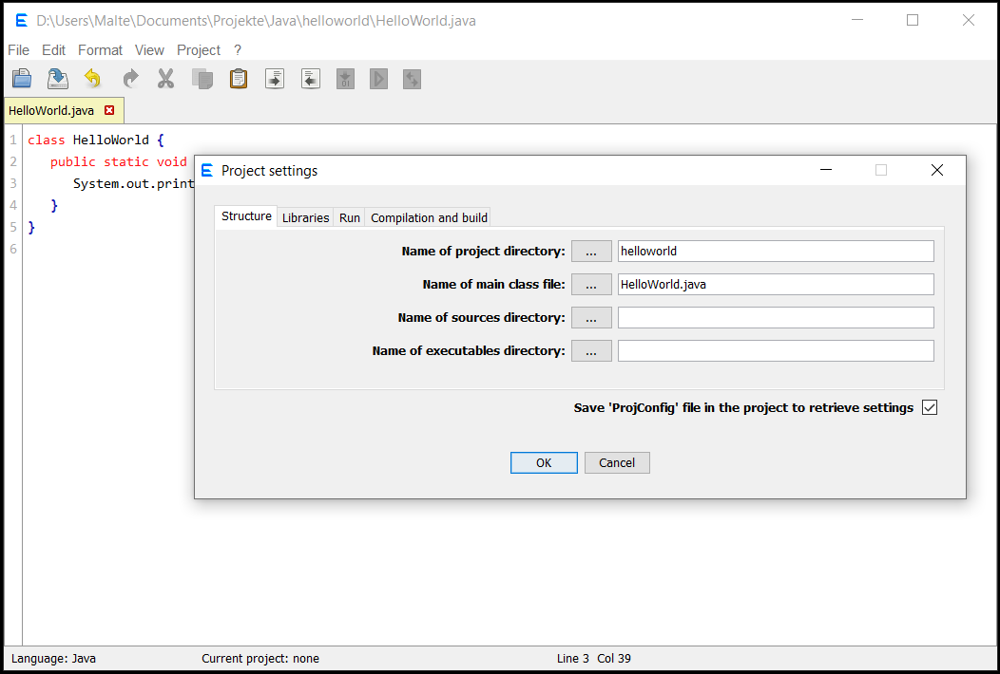
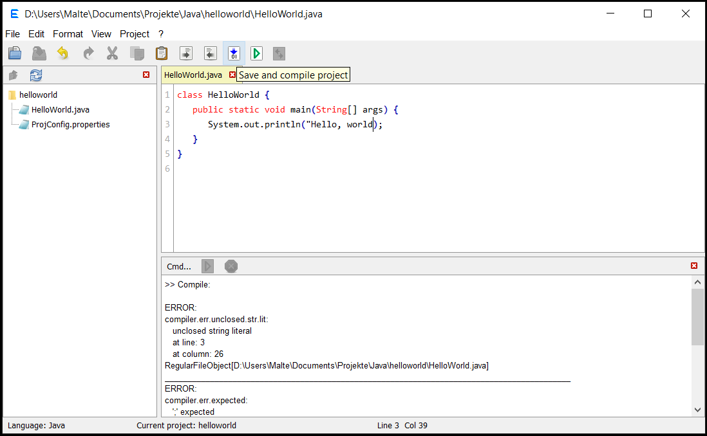
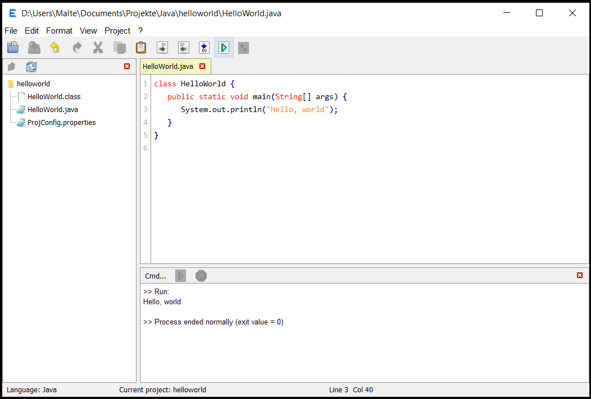

I (Malte) started to make a text editor when I started to learn Java for myself and wished
that Notepad had a compile and a run button. I knew that really versatile code editors and
IDEs exist but using them seemed very complicated to me.

Therefore, a goal is that it is as simple as possible to set up the editor to try out code
from within it and provide at the same time some flexibility to use it for a real
coding project.

The github repository for the program also contains, well ... "releases" (a record of my
attempts to fix bugs and add useful features). Anyway, there an executable jar file of the
program can be found for trying it out (requires JDK 8 or higher).

See also <a href="https://github.com/Eadgyth/Programming-Editor/blob/master/README.md">
README</a> for requirements.

<h3>How to set up Eadgyth to run code?</h3>
The program is set up for running source code by defining a "project". This is initially
just a working directory which distinguishes "project files" from "non-project files" and
where commands (built-in or custom) are executed. Setting a project only requires that any
file that is found in the indended project directory is open and in the selected tab
if multiple files are open. This file may also be found in a sub-directory path relative
to the project directory and does not have to be the "main" source file. The same is true
for running a project: it is not necessary that the "main" source file is selected (it
does not even have to be open) but it is necessary that any file of the project is open
(and selected).

The screenshots below give examples for project settings (the settings dialog is somewhat
modified in newer versions, though).

<h4> Example for a 'Hello World' program in Python</h4>
This is an example for a 'Hello World' program in Python. The script was saved as hello_world.py
in the directory helloworld which is also the indended project root. The project settings are
opened by selecting 'Settings for...' and choosing the category Python:

In the project settings the name of the project directory and the name of the script are
entered:

Then, after clicking OK, the script is run by selecting 'Save and run' in the toolbar or
in the 'Project' menu. This opens the console panel which shows the output:

<h4> Example for a Java program</h4>
For Java the settings could be as simple as in the example for Python above: Just have a
Java file with a main method in any direcory which is set as the project directory.
However, this example simulates a Java project with a directory structure that includes a
source directory, an output directory and a main class that belongs to a package: The
'Hello World' program was saved as HelloWorld.java in the directory ..\helloworld\scr\hello
where 'helloworld' is the indended project directory. 'src' is defined as the source root
directory inside the project and 'hello' is a directory that corresponds to the package
which the source file belongs to. The package name is declared at the top of the code. The
project settings are opened by choosing the category Java:

The name of the project directory, the name of the source directory and the name of the
Java file (could also be qualified: hello.HelloWorld) are entered. Finally, the name for
a distination directory for a compiled class file (next step) is specified. This directory
does not have to exists initially.

<blockquote>NOTE: If a main Java source file is part of a package but is not saved in a
subdirectory (path) that corresponds to the package the qualified name (e.g.
my.package.myprogram.java) must be specified to be able to run the program.</blockquote>
 
A project may be viewed in the 'Project explorer'. After a try to compile the program the
console shows the error in the code:

After correcting the code a new compilation generates the class file hello\HelloWorld.class
in the 'bin' directory and the program can be run:

Please also have a look at the
<a href="https://eadgyth.github.io/Programming-Editor/help/help.html">help site</a> which is
also accessible from the '?' menu.
