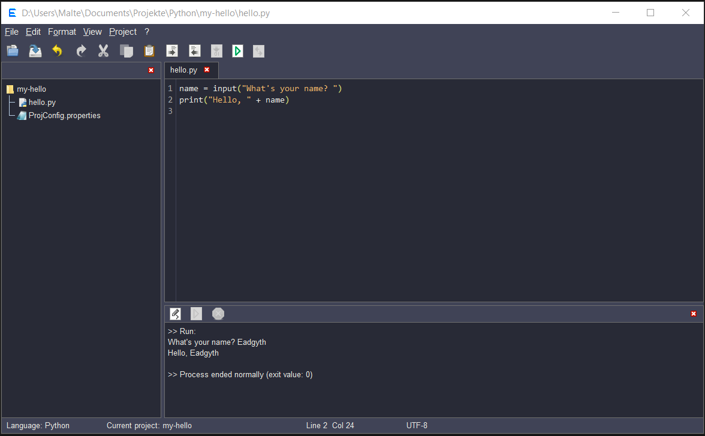
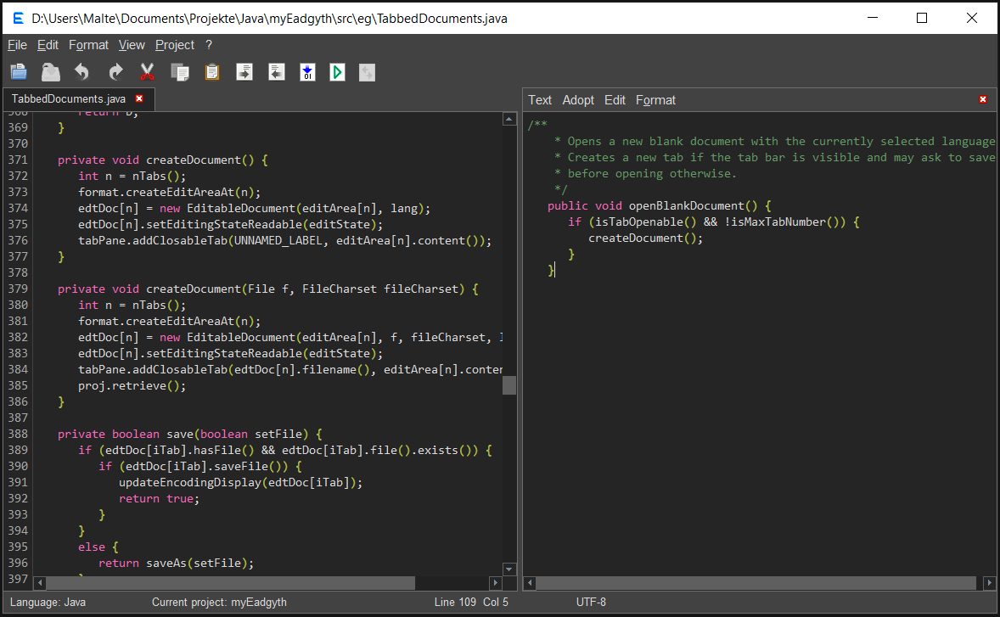
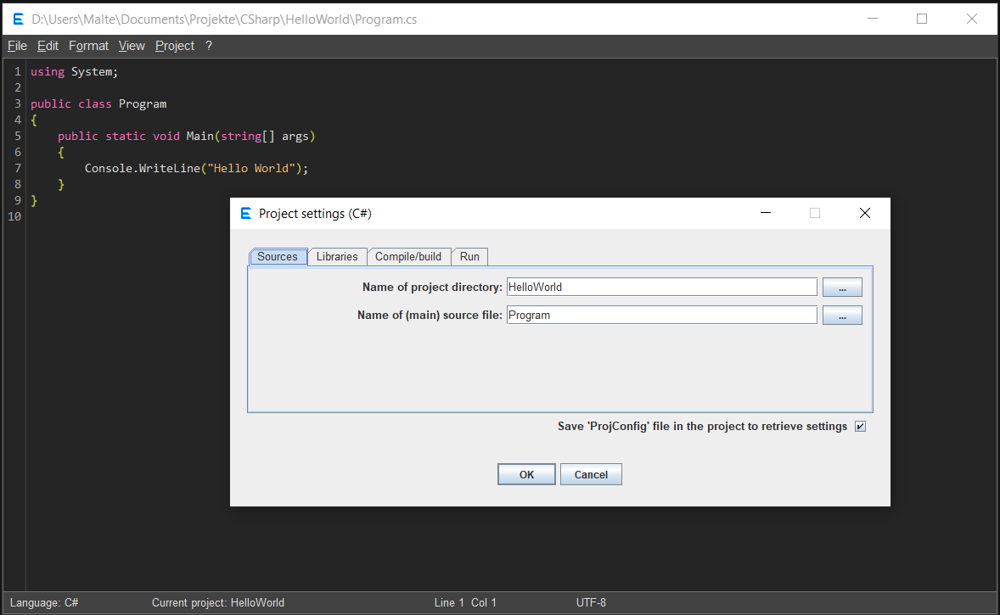
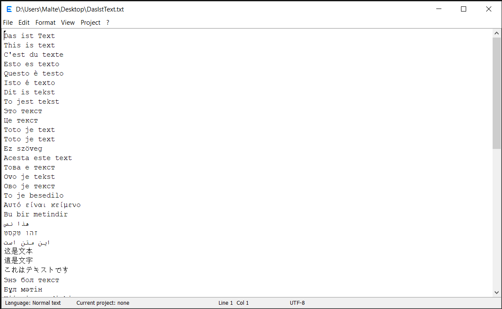

This site summarizes the updated features of the editor and displays the images from the repository's <a href="https://github.com/Eadgyth/Programming-Editor/tree/master/docs">docs</a> folder.

If you give the editor a try, I would be grateful for comments via the GitHub Issues page. The editor is best suited for personal use when a full IDE is not required. The goal is to provide an easy setup to try out your own code, while maintaining enough flexibility to use it for real coding projects.

<h4>Recent change</h4>

As of v1.2.1 the editor checks files for UTF-8 encoding. It uses the system's encoding or a selectable encoding for opening non-UTF-8 files as fallback. To compile/run source code, the editor now requires UTF-8 for reliable output. An option to convert files to UTF-8 is available.</li>
 
<h4>Features for editing text are ...</h4>
<ul>
<li>Find/replace (where also "replace all" is undoable/redoable)</li>
<li>Clearing end-of-line (trailing) white spaces.</li>
<li>Choosing between spaces and tabs for indentation (without replacement of the indentation in the whole file).</li>
<li>Auto-indentation which distinguishes "curly-bracket-indentation".</li>
<li>Block-wise or line-wise increase or decrease of the indentation.</li>
<li>A 'notes' editor next to the main editor with shortcuts to exchange text.</li>
<li>A basic syntax highlighting (for Java, C#, Python, R, HTML, XML, CSS, JavaScript, PHP).</li>
</ul>

<h4>Features for running source code are ...</h4>
<ul>
<li>Compile and run Java code that may be organized in packages and create an executable jar file. Includes support for using external libraries. A Java program may also be run on the module path.</li>
<li>Compile and run C# code. The internal commands use .NET SDK (as of vs. 1.2.1.) Note: the editor creates a new minimal .csproj file on every compile.</li>
<li>Run scripts in Python or R.</li>
<li>Specify additional options or arguments for the built-in commands.</li>
<li>Run own commands in a project categorie "Custom Commands".</li>
<li>View HTML code in the default browser.</li>
<li>A console for showing output/error during running (or compiling) a program and entering input in interactive command-line programs.</li>
<li>Set up several projects which can be switched between and retrieve project settings after newly starting the editor.</li>
</ul>
  
  
  
  
  

